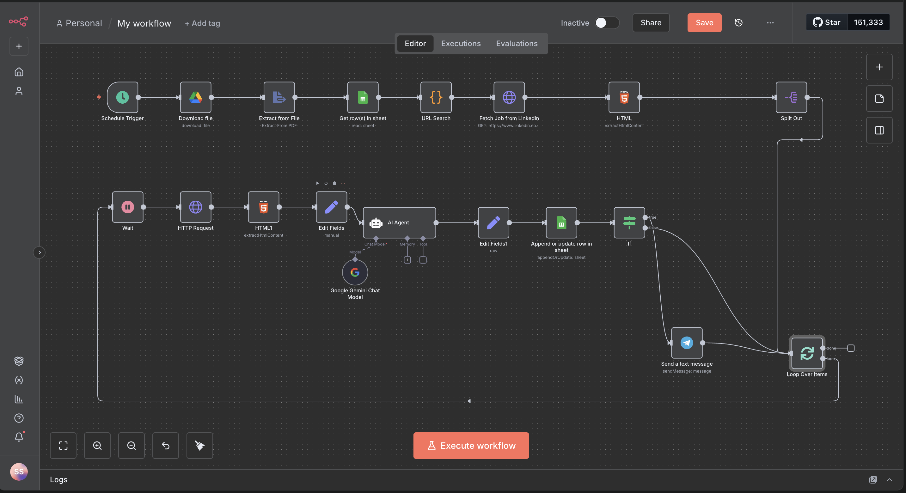
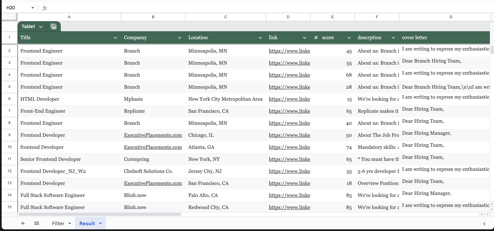
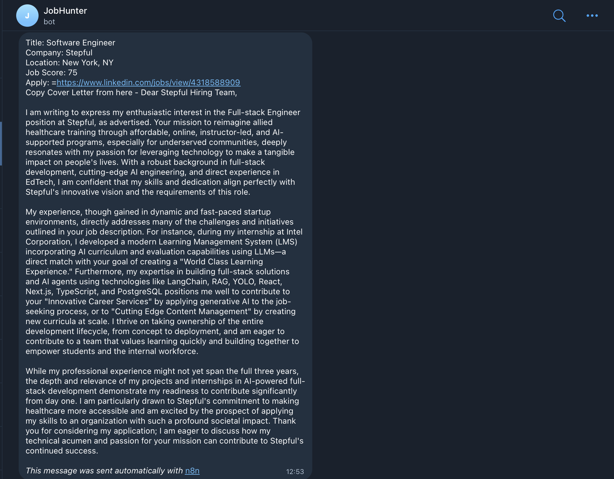
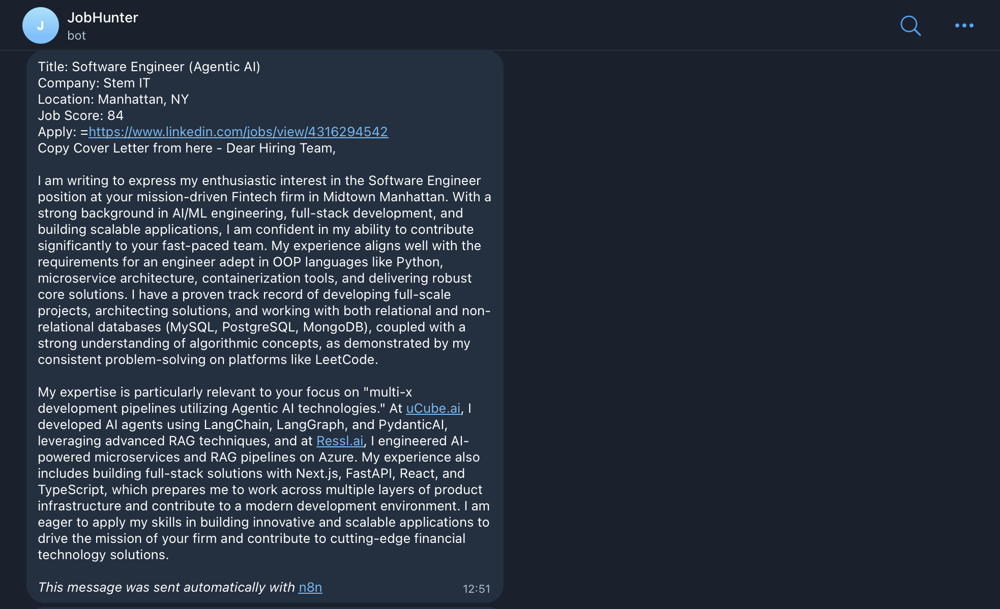

# LinkedIn Job Hunting Automation Bot

This repository contains a job hunting automation bot built using n8n, an open-source workflow automation tool.

## Overview

This repository contains a **LinkedIn Job Hunting Automation Bot** built using [n8n](https://n8n.io/), an open-source workflow automation tool. The bot automates the process of searching for job postings on LinkedIn, filtering them based on user-defined criteria, and performing actions such as saving jobs, sending notifications, or applying to relevant positions.

The goal of this project is to streamline the job search process, saving time and effort by automating repetitive tasks on LinkedIn.

## Features

### Job Search Automation

Automatically searches for jobs on LinkedIn based on keywords, location, and other filters.

### Custom Filtering
Filters job postings by criteria such as job title, company, experience level, or posting date.

### Action Triggers
Performs actions like saving jobs, sending email/Slack notifications, or preparing application templates.

### Google Sheets Integration

The extracted job data is sent to a Google Sheets node, which appends or updates a spreadsheet with the job details.

### Telegram Notifications

The Telegram node sends notifications to a user-specified chat or channel with job details and links.

### Customizable Workflows
Built with n8n, allowing easy modification of workflows to suit specific needs.

### Scalable and Extensible
Add new features or integrate with other platforms (e.g., email, spreadsheets) using n8n's modular nodes.

## How It Works

The bot operates through a series of n8n workflows that connect LinkedIn, Google Sheets, Google Drive, and Telegram. Here’s a high-level overview of the process:

1. **Job Data Collection**:
   - The bot uses an HTTP Request node or a scraping tool (e.g., via Puppeteer or similar) to fetch job listings from LinkedIn based on search parameters (e.g., “Software Engineer” in “Remote”).
   - Data is parsed to extract relevant fields like job title, company, location, description, and application URL.

2. **Google Sheets Integration**:
   - The extracted job data is sent to a Google Sheets node, which appends or updates a spreadsheet with the job details.
   - Example fields: `Job Title`, `Company`, `Location`, `Posted Date`, `Apply URL`, `Status`.
   - The spreadsheet can be used for tracking applications or filtering jobs.

3. **Google Drive Integration**:
   - Job descriptions or related documents are saved as files (e.g., PDFs or text) to a specified Google Drive folder.
   - The Google Drive node uploads files and organizes them with metadata (e.g., job title, date).

4. **Telegram Notifications**:
   - The Telegram node sends notifications to a user-specified chat or channel.
   - Notifications include job details, links to the Google Sheet, and links to files stored in Google Drive.
   - Example message: “New job found: Software Engineer at XYZ Corp. Details: [Google Sheet Link]. PDF: [Google Drive Link].”
   - Notification is send with the help of Telegram bot by getting chatid and then making a new bot.P

5. **Scheduling and Triggers**:
   - The workflow is triggered manually or scheduled (e.g., daily at 9 AM) using n8n’s Schedule node.
   - Error handling ensures notifications are sent if the workflow fails (e.g., API errors).